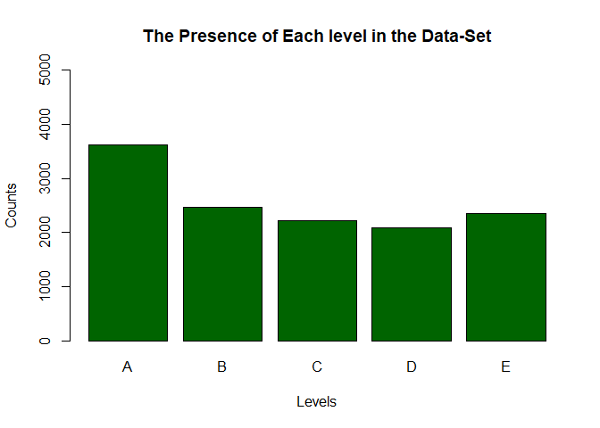
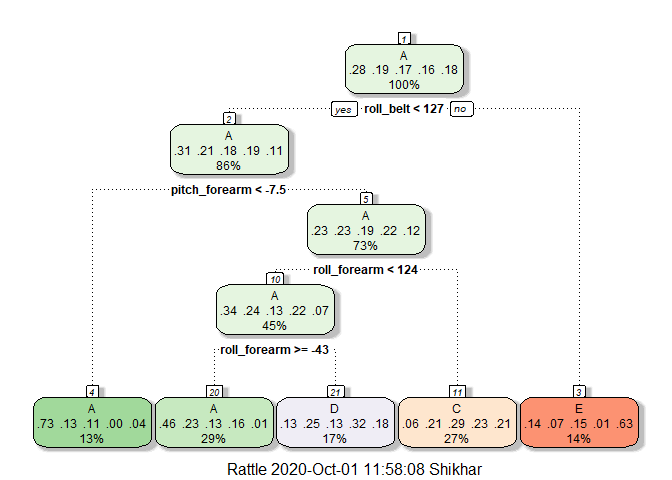
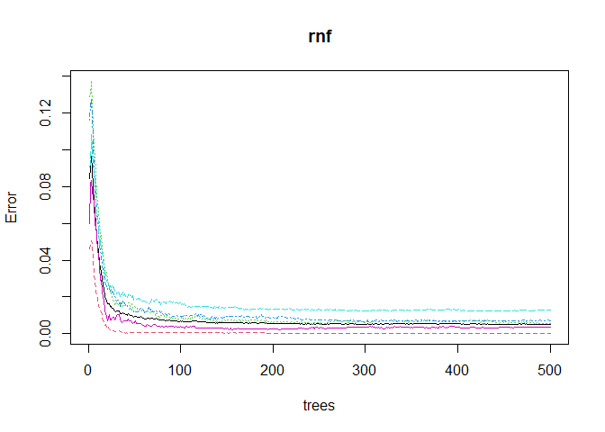

## One thing that people regularly do is quantify how much of a particular activity they do, but they rarely quantify how well they do it. In this project, your goal will be to use data from accelerometers on the belt, forearm, arm, and dumbell of 6 participants.


### Background

Using devices such as Jawbone Up, Nike FuelBand, and Fitbit it is now possible to collect a large amount of data about personal activity relatively inexpensively. These type of devices are part of the quantified self movement – a group of enthusiasts who take measurements about themselves regularly to improve their health, to find patterns in their behavior, or because they are tech geeks. One thing that people regularly do is quantify how much of a particular activity they do, but they rarely quantify how well they do it. In this project, your goal will be to use data from accelerometers on the belt, forearm, arm, and dumbell of 6 participants. They were asked to perform barbell lifts correctly and incorrectly in 5 different ways.

#### The training data for this project are available here:
https://d396qusza40orc.cloudfront.net/predmachlearn/pml-training.csv


#### The test data are available here:
https://d396qusza40orc.cloudfront.net/predmachlearn/pml-testing.csv


#### The data for this project come from this source:
http://web.archive.org/web/20161224072740/http:/groupware.les.inf.puc-rio.br/har. 


### Required Libraries

Loading Libraries


```r
library(caret)
```

```
## Warning: package 'caret' was built under R version 4.0.2
```

```
## Loading required package: lattice
```

```
## Loading required package: ggplot2
```

```
## Warning: package 'ggplot2' was built under R version 4.0.2
```

```r
library(rpart); library(rpart.plot)
```

```
## Warning: package 'rpart.plot' was built under R version 4.0.2
```

```r
library(rattle)
```

```
## Warning: package 'rattle' was built under R version 4.0.2
```

```
## Loading required package: tibble
```

```
## Loading required package: bitops
```

```
## Rattle: A free graphical interface for data science with R.
## Version 5.4.0 Copyright (c) 2006-2020 Togaware Pty Ltd.
## Type 'rattle()' to shake, rattle, and roll your data.
```

```r
library(randomForest)
```

```
## Warning: package 'randomForest' was built under R version 4.0.2
```

```
## randomForest 4.6-14
```

```
## Type rfNews() to see new features/changes/bug fixes.
```

```
## 
## Attaching package: 'randomForest'
```

```
## The following object is masked from 'package:rattle':
## 
##     importance
```

```
## The following object is masked from 'package:ggplot2':
## 
##     margin
```

### Setting up the Files,
Here we will download and read the training set and test set.


```r
 download.file(url = "https://d396qusza40orc.cloudfront.net/predmachlearn/pml-training.csv",
             destfile = "./trainingfile.csv")
training <- read.csv("./trainingfile.csv",na.strings=c("NA","#DIV/0!", ""))
download.file("https://d396qusza40orc.cloudfront.net/predmachlearn/pml-testing.csv",destfile = "./testfile.csv")
test <- read.csv("./testfile.csv",na.strings=c("NA","#DIV/0!", ""))
names(training)
```

```
##   [1] "X"                        "user_name"               
##   [3] "raw_timestamp_part_1"     "raw_timestamp_part_2"    
##   [5] "cvtd_timestamp"           "new_window"              
##   [7] "num_window"               "roll_belt"               
##   [9] "pitch_belt"               "yaw_belt"                
##  [11] "total_accel_belt"         "kurtosis_roll_belt"      
##  [13] "kurtosis_picth_belt"      "kurtosis_yaw_belt"       
##  [15] "skewness_roll_belt"       "skewness_roll_belt.1"    
##  [17] "skewness_yaw_belt"        "max_roll_belt"           
##  [19] "max_picth_belt"           "max_yaw_belt"            
##  [21] "min_roll_belt"            "min_pitch_belt"          
##  [23] "min_yaw_belt"             "amplitude_roll_belt"     
##  [25] "amplitude_pitch_belt"     "amplitude_yaw_belt"      
##  [27] "var_total_accel_belt"     "avg_roll_belt"           
##  [29] "stddev_roll_belt"         "var_roll_belt"           
##  [31] "avg_pitch_belt"           "stddev_pitch_belt"       
##  [33] "var_pitch_belt"           "avg_yaw_belt"            
##  [35] "stddev_yaw_belt"          "var_yaw_belt"            
##  [37] "gyros_belt_x"             "gyros_belt_y"            
##  [39] "gyros_belt_z"             "accel_belt_x"            
##  [41] "accel_belt_y"             "accel_belt_z"            
##  [43] "magnet_belt_x"            "magnet_belt_y"           
##  [45] "magnet_belt_z"            "roll_arm"                
##  [47] "pitch_arm"                "yaw_arm"                 
##  [49] "total_accel_arm"          "var_accel_arm"           
##  [51] "avg_roll_arm"             "stddev_roll_arm"         
##  [53] "var_roll_arm"             "avg_pitch_arm"           
##  [55] "stddev_pitch_arm"         "var_pitch_arm"           
##  [57] "avg_yaw_arm"              "stddev_yaw_arm"          
##  [59] "var_yaw_arm"              "gyros_arm_x"             
##  [61] "gyros_arm_y"              "gyros_arm_z"             
##  [63] "accel_arm_x"              "accel_arm_y"             
##  [65] "accel_arm_z"              "magnet_arm_x"            
##  [67] "magnet_arm_y"             "magnet_arm_z"            
##  [69] "kurtosis_roll_arm"        "kurtosis_picth_arm"      
##  [71] "kurtosis_yaw_arm"         "skewness_roll_arm"       
##  [73] "skewness_pitch_arm"       "skewness_yaw_arm"        
##  [75] "max_roll_arm"             "max_picth_arm"           
##  [77] "max_yaw_arm"              "min_roll_arm"            
##  [79] "min_pitch_arm"            "min_yaw_arm"             
##  [81] "amplitude_roll_arm"       "amplitude_pitch_arm"     
##  [83] "amplitude_yaw_arm"        "roll_dumbbell"           
##  [85] "pitch_dumbbell"           "yaw_dumbbell"            
##  [87] "kurtosis_roll_dumbbell"   "kurtosis_picth_dumbbell" 
##  [89] "kurtosis_yaw_dumbbell"    "skewness_roll_dumbbell"  
##  [91] "skewness_pitch_dumbbell"  "skewness_yaw_dumbbell"   
##  [93] "max_roll_dumbbell"        "max_picth_dumbbell"      
##  [95] "max_yaw_dumbbell"         "min_roll_dumbbell"       
##  [97] "min_pitch_dumbbell"       "min_yaw_dumbbell"        
##  [99] "amplitude_roll_dumbbell"  "amplitude_pitch_dumbbell"
## [101] "amplitude_yaw_dumbbell"   "total_accel_dumbbell"    
## [103] "var_accel_dumbbell"       "avg_roll_dumbbell"       
## [105] "stddev_roll_dumbbell"     "var_roll_dumbbell"       
## [107] "avg_pitch_dumbbell"       "stddev_pitch_dumbbell"   
## [109] "var_pitch_dumbbell"       "avg_yaw_dumbbell"        
## [111] "stddev_yaw_dumbbell"      "var_yaw_dumbbell"        
## [113] "gyros_dumbbell_x"         "gyros_dumbbell_y"        
## [115] "gyros_dumbbell_z"         "accel_dumbbell_x"        
## [117] "accel_dumbbell_y"         "accel_dumbbell_z"        
## [119] "magnet_dumbbell_x"        "magnet_dumbbell_y"       
## [121] "magnet_dumbbell_z"        "roll_forearm"            
## [123] "pitch_forearm"            "yaw_forearm"             
## [125] "kurtosis_roll_forearm"    "kurtosis_picth_forearm"  
## [127] "kurtosis_yaw_forearm"     "skewness_roll_forearm"   
## [129] "skewness_pitch_forearm"   "skewness_yaw_forearm"    
## [131] "max_roll_forearm"         "max_picth_forearm"       
## [133] "max_yaw_forearm"          "min_roll_forearm"        
## [135] "min_pitch_forearm"        "min_yaw_forearm"         
## [137] "amplitude_roll_forearm"   "amplitude_pitch_forearm" 
## [139] "amplitude_yaw_forearm"    "total_accel_forearm"     
## [141] "var_accel_forearm"        "avg_roll_forearm"        
## [143] "stddev_roll_forearm"      "var_roll_forearm"        
## [145] "avg_pitch_forearm"        "stddev_pitch_forearm"    
## [147] "var_pitch_forearm"        "avg_yaw_forearm"         
## [149] "stddev_yaw_forearm"       "var_yaw_forearm"         
## [151] "gyros_forearm_x"          "gyros_forearm_y"         
## [153] "gyros_forearm_z"          "accel_forearm_x"         
## [155] "accel_forearm_y"          "accel_forearm_z"         
## [157] "magnet_forearm_x"         "magnet_forearm_y"        
## [159] "magnet_forearm_z"         "classe"
```


## Cleaning the data set.
Removing NA values and cleaning the dataset.

```r
training <- training[,colSums(is.na(training))==0]
test <- test[,colSums(is.na(test))==0]
dim(training)
```

```
## [1] 19622    60
```

```r
training <- training[,-c(1:7)]
test <- test[,-c(1:7)]
```
## Seperating test set and training set from Training set given.

Here, we will be seperating the test set and training set from the training set given to us.


```r
set.seed(1-10-2020)
traintraining <- createDataPartition(y = training$classe,p = 0.65,list = FALSE)
testtraining <- training[-traintraining,]
traintraining <- training[traintraining,]

dim(testtraining)
```

```
## [1] 6865   53
```

```r
dim(traintraining)
```

```
## [1] 12757    53
```


## The frequency of each Level present in "classe" variable of the data set.


```r
plot(as.factor(traintraining$classe),col = "dark green",
     xlab="Levels",ylab = "Counts",main="The Presence of Each level in the Data-Set",ylim = c(-1,5000))
```

<!-- -->

```r
traintraining$classe <- as.factor(traintraining$classe)
testtraining$classe <- as.factor(testtraining$classe)
```
Therefore, the graph tells us presencr of each level in Data set and their frequency.

## 1.Decision Tree


```r
dsc <- rpart(classe~.,data = traintraining,method="class",control = rpart.control(minsplit = 4959,maxdepth = 9))
fancyRpartPlot(dsc)
```

<!-- -->

```r
predictionsA <- predict(dsc,testtraining, type = "class")
confusionMatrix(predictionsA,testtraining$classe)
```

```
## Confusion Matrix and Statistics
## 
##           Reference
## Prediction    A    B    C    D    E
##          A 1569  603  376  338   49
##          B    0    0    0    0    0
##          C  111  379  528  411  405
##          D  139  281  142  369  168
##          E  134   65  151    7  640
## 
## Overall Statistics
##                                           
##                Accuracy : 0.4524          
##                  95% CI : (0.4406, 0.4643)
##     No Information Rate : 0.2845          
##     P-Value [Acc > NIR] : < 2.2e-16       
##                                           
##                   Kappa : 0.297           
##                                           
##  Mcnemar's Test P-Value : < 2.2e-16       
## 
## Statistics by Class:
## 
##                      Class: A Class: B Class: C Class: D Class: E
## Sensitivity            0.8034   0.0000  0.44110  0.32800  0.50713
## Specificity            0.7219   1.0000  0.76958  0.87282  0.93628
## Pos Pred Value         0.5346      NaN  0.28790  0.33576  0.64193
## Neg Pred Value         0.9023   0.8066  0.86702  0.86889  0.89400
## Prevalence             0.2845   0.1934  0.17436  0.16387  0.18383
## Detection Rate         0.2286   0.0000  0.07691  0.05375  0.09323
## Detection Prevalence   0.4275   0.0000  0.26715  0.16009  0.14523
## Balanced Accuracy      0.7626   0.5000  0.60534  0.60041  0.72171
```


## 2. Random Forest

```r
rnf <- randomForest(classe~.,data = traintraining)
predictionsB1 <- predict(rnf,testtraining, type = "class")
testtraining$classe <- as.factor(testtraining$classe)
plot(rnf)
```

<!-- -->

```r
confusionMatrix(predictionsB1,testtraining$classe)
```

```
## Confusion Matrix and Statistics
## 
##           Reference
## Prediction    A    B    C    D    E
##          A 1951   11    0    0    0
##          B    2 1316   11    0    0
##          C    0    1 1184   23    0
##          D    0    0    2 1099    1
##          E    0    0    0    3 1261
## 
## Overall Statistics
##                                           
##                Accuracy : 0.9921          
##                  95% CI : (0.9897, 0.9941)
##     No Information Rate : 0.2845          
##     P-Value [Acc > NIR] : < 2.2e-16       
##                                           
##                   Kappa : 0.99            
##                                           
##  Mcnemar's Test P-Value : NA              
## 
## Statistics by Class:
## 
##                      Class: A Class: B Class: C Class: D Class: E
## Sensitivity            0.9990   0.9910   0.9891   0.9769   0.9992
## Specificity            0.9978   0.9977   0.9958   0.9995   0.9995
## Pos Pred Value         0.9944   0.9902   0.9801   0.9973   0.9976
## Neg Pred Value         0.9996   0.9978   0.9977   0.9955   0.9998
## Prevalence             0.2845   0.1934   0.1744   0.1639   0.1838
## Detection Rate         0.2842   0.1917   0.1725   0.1601   0.1837
## Detection Prevalence   0.2858   0.1936   0.1760   0.1605   0.1841
## Balanced Accuracy      0.9984   0.9943   0.9925   0.9882   0.9993
```
So, the accuracy of Random Forest is better here.

## Final Prediciton!
The final prediction will be based upon the Random Forest algorithm because it had the better accuracy here.


```r
finalpred <- predict(rnf,test,type="class")
finalpred
```

```
##  1  2  3  4  5  6  7  8  9 10 11 12 13 14 15 16 17 18 19 20 
##  B  A  B  A  A  E  D  B  A  A  B  C  B  A  E  E  A  B  B  B 
## Levels: A B C D E
```
